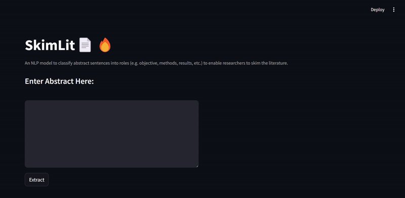

# SkimLit: NLP Model for Medical Abstract Classification

## Project Description
SkimLit is an NLP-based web application designed to help researchers efficiently classify sentences in medical abstracts. The model identifies the role of each sentence (e.g., objective, methods, results), allowing users to quickly skim through research literature and find relevant sections for deeper exploration.

This project replicates the deep learning models outlined in the 2017 paper, **PubMed 200k RCT: A Dataset for Sequential Sentence Classification in Medical Abstracts**.

---

## Table of Contents
1. [Dataset Overview](#dataset-overview)
2. [Preprocessing & Embeddings](#preprocessing--embeddings)
3. [Baseline Models](#baseline-models)
4. [Deep Learning Models](#deep-learning-models)
5. [Deployment](#deployment)
6. [Results](#results)
7. [Scope for Improvement](#scope-for-improvement)
8. [Conclusion](#conclusion)
9. [Contact](#contact)

---

## Dataset Overview
The **PubMed 200k RCT** dataset is used for this project. It contains medical abstracts with labeled sentences identifying their role in the abstract.

- **Source**: [GitHub Repository](https://github.com/Franck-Dernoncourt/pubmed-rct)
- **Classes**: Objective, Methods, Results, Background, Conclusions

---

## Preprocessing & Embeddings

### Preprocessing Steps:
- **Tokenization**: Sentences are broken down into words or characters.
- **Text Cleaning**: HTML tags, punctuation, and other noise are removed.

### Embeddings Used:
- **Universal Sentence Encoder (USE)**: Pretrained sentence-level embeddings.
- **Character-level Embeddings**: To capture morphological information.

---

## Baseline Models
Several machine learning models were tested to establish a baseline for classification:

- **Multinomial Naive Bayes (MNB)**

model was evaluated using accuracy, precision, recall, and F1-score.

---

## Deep Learning Models
The project implements various deep learning models to improve classification performance:

1. **Conv1D with Token Embeddings**:
   - Uses token embeddings to capture word-level semantics.
   Acc -->  80.15%

   

2. **Hybrid Embeddings**:
   - Combines token and character embeddings with positional encoding for richer text representation.
   Acc -->  77.66%

   
   
3. **Pretrained Model (USE)**:
   - Extracts features from the entire sentence.
   Acc -->  76.57%

   

4. **Tribrid embedding model**:
   - Transfer Learning with pretrained token embeddings + character embeddings + positional embeddings.
   Acc -->  86.637%
   
   

**Best Performance Model** 

 

---

## Deployment
The web app was developed using **Streamlit** , allowing users to classify medical abstract sentences in real-time.

---

## Results
Here’s a summary of the performance across different models:

---

## Scope for Improvement
- **Larger Datasets**: Leveraging more data can improve model generalization.
- **Advanced Pretrained Models**: Experiment with other state-of-the-art models like GPT-based architectures.

---

## Conclusion
This project successfully replicates a deep learning approach to classifying sentences in medical abstracts. The best model, using Tribrid embedding model, achieved an accuracy of 87%, showcasing the power of transfer learning in NLP tasks.

---

## Contact
Feel free to reach out for collaborations or inquiries:

- **Email**: [rehababdelmoneim755@gmail.com](mailto:rehababdelmoneim755@gmail.com)

- **Linkedin** : [www.linkedin.com/in/abdelmoneim77](www.linkedin.com/in/abdelmoneim77)
